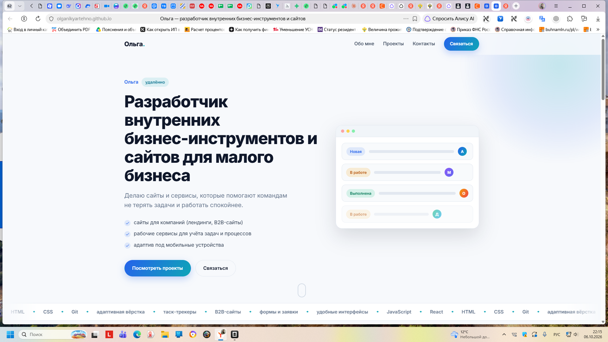
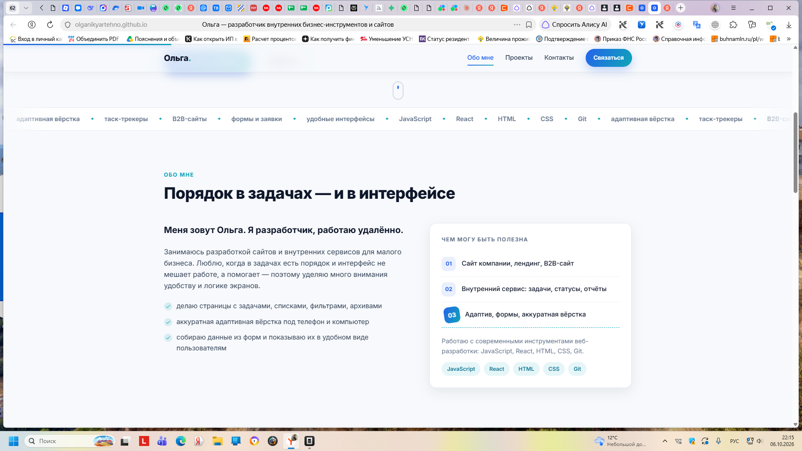
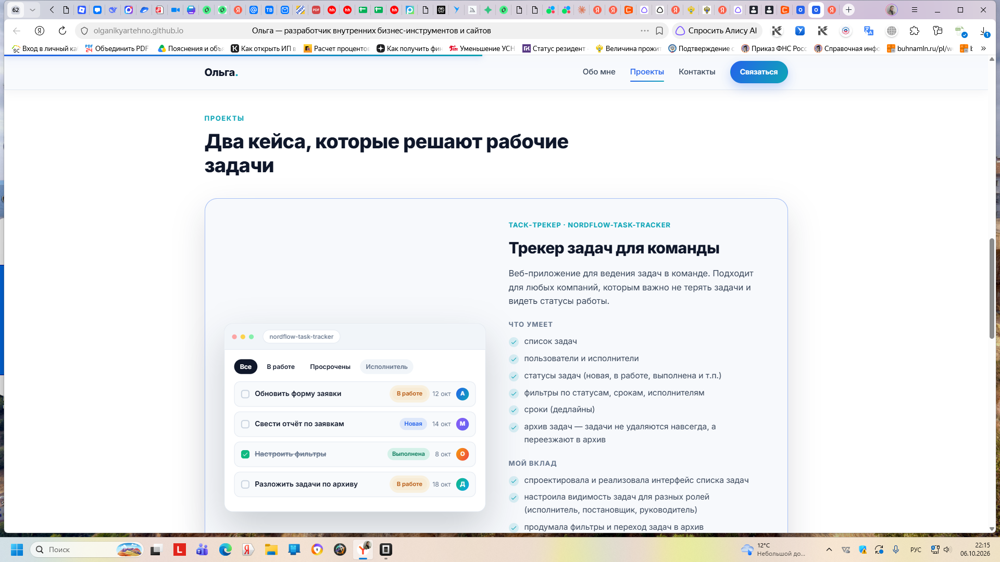
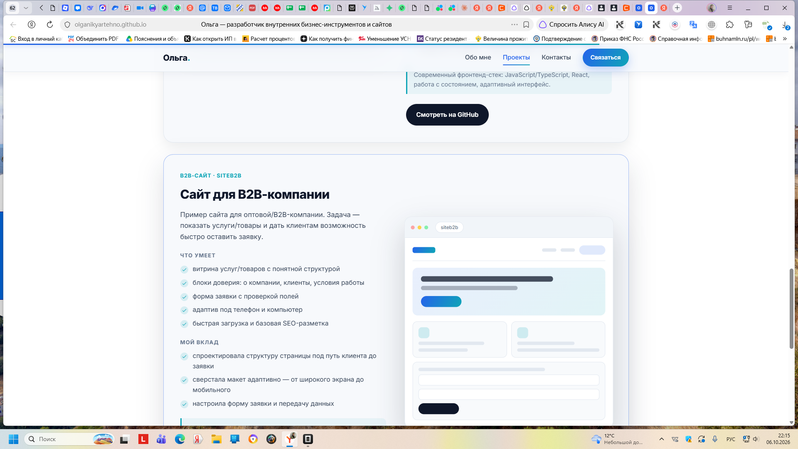
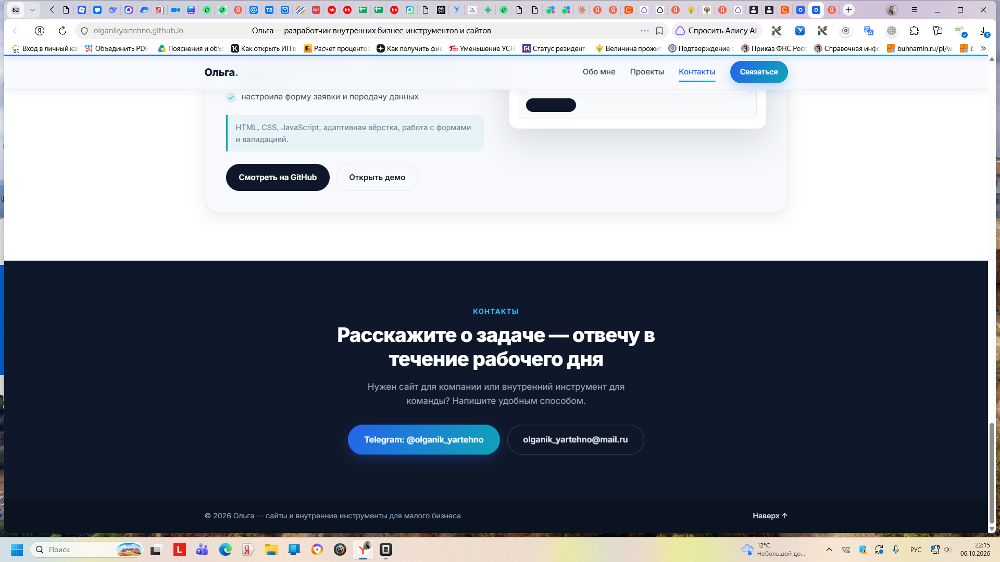

# Сайт-портфолио Ольги

Одностраничный сайт-портфолио: сайты и внутренние инструменты для малого бизнеса.

**Сайт в сети:** https://olganikyartehno.github.io/olga-portfolio/

## Скриншоты

**Главный экран**



**Обо мне**



**Проект 1 — трекер задач**



**Проект 2 — B2B-сайт**



**Контакты**



## Что внутри

Одностраничный лендинг с якорной навигацией, четыре блока:

| Блок | Содержание |
|---|---|
| Главный экран | Позиционирование, список услуг, кнопки «Посмотреть проекты» и «Связаться» |
| Обо мне | Кто я, чем занимаюсь, навыки простым языком, стек |
| Проекты | Два кейса: таск-трекер `nordflow-task-tracker` и B2B-сайт `siteb2b` |
| Контакты | Telegram `@olganik_yartehno` и почта `olganik_yartehno@mail.ru` |

## Технологии

- HTML5, CSS3, JavaScript (без сборщиков и зависимостей)
- Шрифт Inter с Google Fonts (при недоступности подставляется системный)
- Кейсы оформлены CSS-мокапами интерфейсов — заменяются на реальные скриншоты

## Возможности

- адаптивная вёрстка от 390 px до десктопа
- мобильное меню-бургер, плавный скролл с якорями, подсветка активного пункта
- прогресс-бар прокрутки, бегущая строка со стеком, ступенчатое появление блоков
- параллакс-свечение в hero, hover-эффекты на кейсах, кнопках и тегах
- поддержка `prefers-reduced-motion` — анимации отключаются

## Структура файлов

```
index.html      — разметка страницы
css/styles.css  — стили, анимации, адаптив
js/main.js      — меню, скролл, прогресс, параллакс, появление блоков
```

## Локальный запуск

Открыть `index.html` в браузере двойным кликом — сборка не нужна.

Локальный сервер (опционально):

```bash
npx serve .
```

## Публикация

Сайт размещён на GitHub Pages из ветки `main`. Для обновления:

```bash
git add -A
git commit -m "Обновление сайта"
git push
```

Pages пересоберётся автоматически, сайт обновится за минуту-две.

## Что заменить перед публикацией кейсов

- ссылки «Смотреть на GitHub» в обоих проектах (сейчас ведут на github.com)
- «Открыть демо» у B2B-сайта
- CSS-мокапы — на реальные скриншоты интерфейсов
